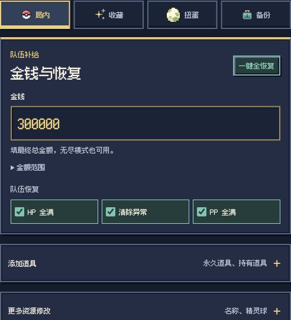
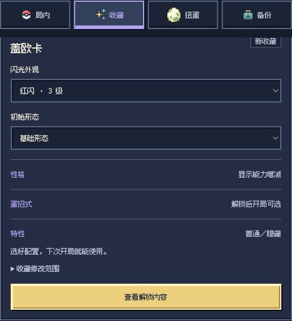
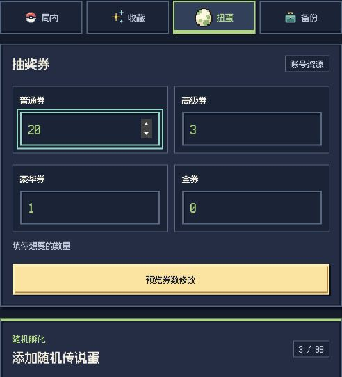

<div align="center">
  <h1>洛托姆口袋 · 宝可梦肉鸽辅助工具</h1>
  <p>Rotom Pocket · PokéRogue Save Editor</p>
  <p>一个住在 Chrome 侧栏里的 PokéRogue 小帮手。</p>
  <p><a href="https://github.com/seu-yolo/rotom-pocket/releases/tag/v1.0.0">下载安装包</a> · <a href="#安装">安装方法</a> · <a href="docs/USAGE.md">使用说明</a> · <a href="https://github.com/seu-yolo/rotom-pocket/issues">反馈问题</a></p>
  <p><sub>v1.0.0 · Chrome 116+ · 适配游戏 1.12.0.10 / 1.12.0.11</sub></p>
</div>

洛托姆口袋是宝可梦肉鸽（PokéRogue）的非官方存档修改器。你可以为当前队伍补给，解锁喜欢的初始伙伴，或补充扭蛋资源。直接在侧栏操作，不用打开开发者工具；切换波数或存档后也能继续使用。

## 界面一览

<table>
  <tr><th>局内补给</th><th>永久收藏</th><th>扭蛋资源</th></tr>
  <tr>
    <td valign="top"><a href="docs/assets/readme-minimal/run.jpg"></a></td>
    <td valign="top"><a href="docs/assets/readme-minimal/collection.jpg"></a></td>
    <td valign="top"><a href="docs/assets/readme-minimal/gacha.jpg"></a></td>
  </tr>
  <tr><td>金钱自己填，队伍一起恢复。</td><td>就决定是你了！</td><td>随机孵化，保留惊喜。</td></tr>
</table>

<sub>截图来自合成数据界面预览，未连接游戏或执行保存。点击图片可以看大图；可选配置以游戏图鉴为准。</sub>

## 认识宝可梦肉鸽

[PokéRogue（宝可梦肉鸽）](https://pokerogue.net/) 是由 [Pagefault Games](https://github.com/pagefaultgames) 与社区共同开发的浏览器宝可梦同人游戏。它把回合制对战和 Roguelite 闯关结合起来：挑选初始伙伴，挑战野生宝可梦和训练家，在战后选择奖励，带着队伍探索不同地形。

捕获和孵化会丰富初始宝可梦收藏，让下一局有更多搭配。经典模式适合挑战通关，无尽模式可以继续尝试队伍的极限。玩法详解见 [官方新手指南](https://wiki.pokerogue.net/guides:new_player_guide)，代码与贡献者见 [游戏源码](https://github.com/pagefaultgames/pokerogue) 和 [贡献者名单](https://github.com/pagefaultgames/pokerogue/blob/main/CREDITS.md)。

<details>
<summary>看看游戏画面</summary>

<p></p>
<p></p>

<sub>官方代码的离线演示画面（v1.12.0.11），不含官网账号。游戏与美术属于原项目及相应权利方。</sub>

</details>

> 希望你先享受游戏本身。试试不同队伍，期待下一次遭遇，也给自己留一点挑战。口袋按需、少量使用就好，别让修改替代了探索和成长的乐趣。

## 功能

| 页面 | 可以做什么 |
| --- | --- |
| 局内 | 自定金钱、全队恢复，补充精灵球与受支持的道具；调整亲密度、宝可病毒、进化和 IV；单次等待当地稀有野生遭遇 |
| 收藏 | 永久解锁初始伙伴，定制闪光、可选形态、性格、蛋招式和特性，保留已有收藏；新增内容在下次开局时使用 |
| 扭蛋 | 设置四种抽奖券的目标总数，选择三台官方扭蛋机的来源，添加内容未知的随机传说蛋，仍需完成 100 波孵化时间 |
| 备份 | 导出原生对局／账号 `.prsv`，查看本机修改记录；局内修改支持同状态撤销 |

金钱和券数填的是最终总量。道具显示当前层数、游戏中的实际上限和剩余额度；持有道具按所选宝可梦分别计算。完整功能范围见 [使用说明](docs/USAGE.md)。

<a id="安装"></a>

## 下载与安装

官网玩家下载 [RogueSave-v1.0.0.zip](https://github.com/seu-yolo/rotom-pocket/releases/download/v1.0.0/RogueSave-v1.0.0.zip)，解压后安装。下载安装包不需要 Node.js；GitHub 的 `Source code` ZIP 是源码，不是扩展安装包。

1. 在 Chrome 打开 `chrome://extensions/`，开启右上角的“开发者模式”。
2. 点“加载已解压的扩展程序”，选择直接包含 `manifest.json` 的文件夹。
3. 打开 [游戏官网](https://pokerogue.net/)；若已经打开，刷新一次游戏页面。
4. 点击浏览器工具栏的“洛托姆口袋”图标打开侧栏。找不到图标时，在扩展菜单里将它固定。

本机离线游戏使用 [RogueSave-Offline-v1.0.0.zip](https://github.com/seu-yolo/rotom-pocket/releases/download/v1.0.0/RogueSave-Offline-v1.0.0.zip)，只连接 `http://127.0.0.1:8000`，不包含游戏本体。准备方法见 [离线版说明](docs/OFFLINE_TESTING.md)。

升级时更新原来加载的文件夹，再到扩展管理页点“重新加载”。不要卸载扩展或清空数据，否则本机备份和待确认记录可能丢失。`RogueSave` 是项目早期名称，安装包暂时沿用它。

## 第一次使用

1. 只保留一个游戏标签页，进入要修改的对局，停在等待选择招式的界面。
2. 在“备份”下载修改前的原生对局／账号 `.prsv`，留在自己电脑上。
3. 选择要修改的内容。例如把金钱填成 `300000`，或点“一键全恢复”；此时还没有保存。
4. 点“预览”，核对后再点“保存修改”。预览和保存期间先别继续战斗。

收藏和券数同样先预览再确认。添加道具时，选好数量和持有者，点“加入本次修改”，最后一起预览并保存。[道具操作示例](docs/assets/usage-run-items-v1.0.0.jpg)

切换存档后，点口袋顶部“↻ 刷新”重新连接，游戏页保持原样。更新扩展代码则需要在扩展管理页“重新加载”。

## 常见问题

<details>
<summary>连不上，或预览后状态变了</summary>

回到选择招式界面，点口袋顶部“↻ 刷新”，重新预览。如果提示实时会话与缓存不一致，按提示重新载入游戏后再核对。

</details>

<details>
<summary>保存显示“结果待确认”</summary>

先暂停修改，保留本机记录，按提示刷新核对；必要时关闭原游戏标签页，新开同一账号和存档。不要重复保存或卸载扩展来解锁。[详细处理方法](docs/USAGE.md#保存失败或结果待确认)

</details>

<details>
<summary>备份和撤销有什么区别？</summary>

局内撤销要求停留在修改后的同一状态。收藏、券和蛋暂不支持一键撤销。兼容离线版可在“数据管理”中导入原生备份，官网正式版目前没有这个导入入口。修改后再导出的文件不能代替修改前的备份。[备份与撤销说明](docs/USAGE.md#备份与撤销)

</details>

<details>
<summary>游戏更新后不能修改</summary>

扩展需要核对新版的数据结构和保存接口；未适配版本可查看和导出备份，等待适配后再修改。

</details>

## 开发与反馈

欢迎提交 [Issue](https://github.com/seu-yolo/rotom-pocket/issues)，写清 Chrome／扩展／游戏版本、操作步骤、预期结果和错误提示。截图记得遮住账号信息，不要公开上传真实存档、账号导出、凭据或含个人数据的诊断记录。

从源码打包需要 Git 和 Node.js 20+，不需要 `npm install`：

```bash
git clone https://github.com/seu-yolo/rotom-pocket.git
cd rotom-pocket
npm run pack
```

生成的扩展文件夹是 `dist/RogueSave/`。离线版使用 `npm run pack:offline`。开发前请看 [开发说明](docs/DEVELOPMENT.md) 和 [架构说明](docs/ARCHITECTURE.md)；版本变化见 [CHANGELOG](CHANGELOG.md)，其他资料见 [文档导航](docs/README.md)。

## 声明与致谢

这是非官方工具，与 Pagefault Games、PokéRogue 团队、Nintendo、Game Freak 或 The Pokémon Company 没有隶属或合作关系。请只操作你有权控制的数据，修改前留存备份。修改有存档及账号风险，恢复范围见 [使用说明](docs/USAGE.md#备份与撤销)。

修改记录保存在本机。扩展不读取 Cookie、密码或浏览历史，也不把存档上传到第三方服务器；账号通过游戏自身接口保存。保存异常时，请按提示重新载入游戏核对结果。

自有代码与文档采用 [MIT](LICENSE)。第三方图片、字体和游戏截图保留各自许可及权利限制，见 [素材说明](docs/ASSETS.md) 和 [THIRD_PARTY_NOTICES](THIRD_PARTY_NOTICES.md)。感谢 PokéRogue 与社区的作品，以及 [Fusion Pixel Font](https://github.com/TakWolf/fusion-pixel-font) 的中文像素字体。
