<div align="center">
  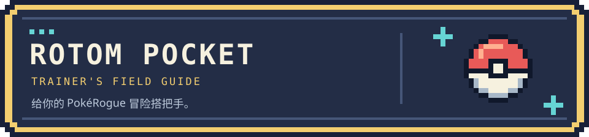
  <h1> 洛托姆口袋</h1>
  <p>一个住在 Chrome 侧栏里的 PokéRogue 小帮手。</p>
  <p><a href="#游戏">认识游戏</a> · <a href="#功能">打开口袋</a> · <a href="#安装">安装扩展</a> · <a href="#上手">第一次使用</a> · <a href="#排错">遇到问题</a></p>
  <p><sub>v1.0.0 · Chrome 116+ · 适配游戏 1.12.0.10 / 1.12.0.11</sub></p>
</div>

<a id="游戏"></a>

## 

[PokéRogue（宝可梦肉鸽）](https://pokerogue.net/) 是一款在浏览器里就能玩的宝可梦同人游戏，把熟悉的回合制对战和 Roguelite 闯关结合在一起。挑选初始伙伴，挑战一波又一波的野生宝可梦和训练家，在战后选择奖励、叠加道具，带着队伍探索不同地形。

一局失败也不算白玩：捕获和孵化会逐渐丰富你的初始宝可梦收藏，让下一次冒险有更多搭配可选。经典模式适合挑战通关，无尽模式则可以继续尝试队伍的极限。玩法详解见 [官方 Wiki 新手指南](https://wiki.pokerogue.net/guides:new_player_guide)。

游戏由 [Pagefault Games](https://github.com/pagefaultgames) 与社区贡献者共同开发维护，感谢他们持续投入代码、美术、音乐和翻译。想体验游戏或支持原项目，可以从这里开始：

[直接游玩](https://pokerogue.net/) · [游戏源码](https://github.com/pagefaultgames/pokerogue) · [新手指南](https://wiki.pokerogue.net/guides:new_player_guide) · [贡献者名单](https://github.com/pagefaultgames/pokerogue/blob/main/CREDITS.md)

<table>
  <tr><th>挑选初始伙伴</th><th>踏上闯关旅程</th></tr>
  <tr>
    <td>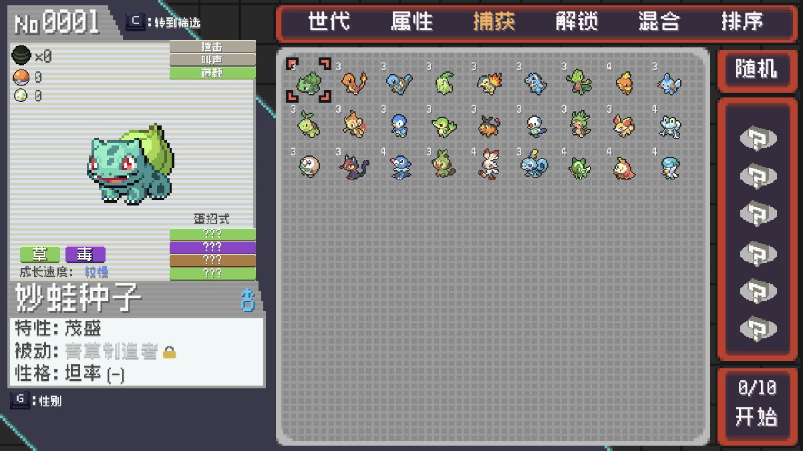</td>
    <td>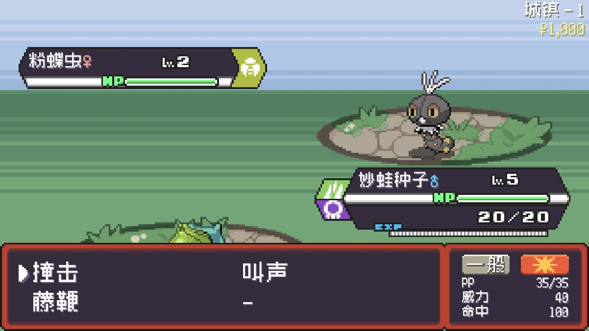</td>
  </tr>
</table>

<p align="center"><sub>官方代码的离线演示画面（v1.12.0.11），不含官网账号。游戏与美术属于原项目及相应权利方。</sub></p>

> **给训练家的一句话**
>
> 希望你先享受游戏本身：试试不同队伍，期待下一次遭遇，也给自己留一点挑战。洛托姆口袋只是一个可选的小帮手，按需、少量使用就好，别让修改替代了探索和成长的乐趣。

<a id="功能"></a>

## 

打开侧栏，就能为当前队伍补给，解锁喜欢的初始伙伴，或补充扭蛋资源。各种波数和存档都可使用，不用打开开发者工具。

<p align="center">
  <a href="#补给">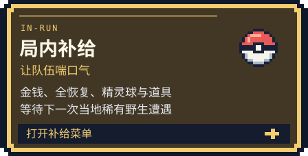</a>
  <a href="#收藏">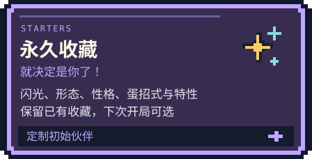</a>
</p>
<p align="center">
  <a href="#扭蛋">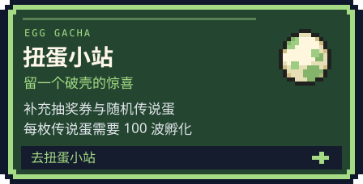</a>
  <a href="docs/USAGE.md#备份与撤销">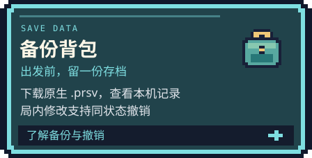</a>
</p>

点击卡片，查看对应功能的使用方法。

亲密度、宝可病毒、暂停进化、满 IV 等进阶操作及完整范围，见 [使用说明](docs/USAGE.md)。

<a id="补给"></a>

### 

需要补给时，打开“局内”页就能调整。

<table>
  <tr>
    <td width="50%" valign="top"><a href="docs/assets/usage-run-money-v1.0.0.jpg">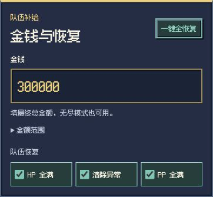</a></td>
    <td valign="top">
      <h4>金钱自己填，队伍一起恢复</h4>
      <p>比如想把金钱设成 300000，就直接填入这个数。填的是最终总额。</p>
      <p>点击“一键全恢复”会勾选 HP 全满、清除异常和 PP 全满；此时只是选好修改内容，还没有保存。</p>
    </td>
  </tr>
  <tr>
    <td valign="top"><a href="docs/assets/usage-run-items-v1.0.0.jpg">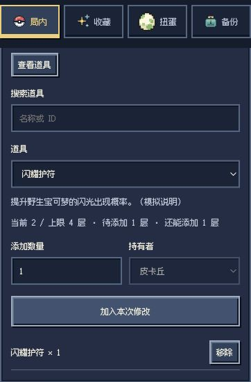</a></td>
    <td valign="top">
      <h4>补充道具，看清剩余额度</h4>
      <p>展开“添加道具”，点“查看道具”，选择道具和数量，再点“加入本次修改”。持有道具还要选择宝可梦。</p>
      <p>图中的护符已有 2 层，上限 4 层；加入 1 层后，还能再添加 1 层。</p>
      <p><sub>点击截图可以查看大图。</sub></p>
    </td>
  </tr>
</table>

选好后，点击底部“预览”，核对内容，再点“保存修改”。预览期间先别继续战斗，以免游戏状态变化后需要重新预览。

<a id="收藏"></a>

### 

在“收藏”搜索名字或编号，选中伙伴，再挑选外观、性格和其他配置。已有收藏会保留，新增内容在下次开局时使用。

<details>
<summary>展开收藏与扭蛋界面截图</summary>

<table>
  <tr>
    <th>收藏：定制你的初始伙伴</th>
    <th>扭蛋：补充资源，保留惊喜</th>
  </tr>
  <tr>
    <td valign="top">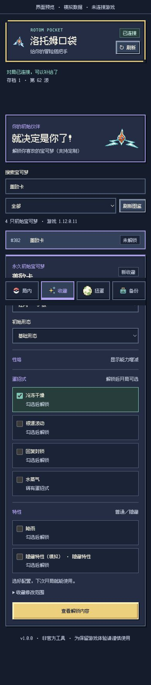</td>
    <td valign="top">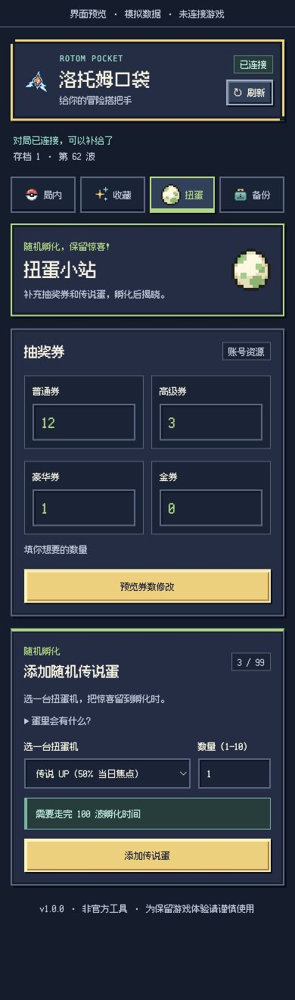</td>
  </tr>
</table>

</details>

<p align="center"><sub>工具截图使用合成数据展示交互，未连接游戏或执行保存；可选配置以游戏图鉴为准。</sub></p>

<a id="扭蛋"></a>

### 

选传说 UP、蛋招式 UP 或闪光 UP，添加由游戏生成的随机传说蛋。每枚蛋需要完成 100 波孵化时间，内容留到破壳时揭晓。想直接解锁指定伙伴，可以用上面的“收藏”。

<a id="安装"></a>

## 

扩展版本为 `1.0.0`，适配 PokéRogue `1.12.0.10` 和 `1.12.0.11`，需要 Chrome `116` 或更新版本。游戏支持范围会随适配更新；未适配版本可查看和导出备份。

目前尚未发布 [Release 安装包](https://github.com/seu-yolo/rotom-pocket/releases)。现在可从源码打包；需要 [Node.js 20+](https://nodejs.org/) 和 Git，不需要 `npm install`：

```bash
git clone https://github.com/seu-yolo/rotom-pocket.git
cd rotom-pocket
npm run pack
```

1. 在 Chrome 地址栏打开 `chrome://extensions/`，开启右上角“开发者模式”。
2. 点击“加载已解压的扩展程序”，选择刚生成的 `dist/RogueSave/` 文件夹（里面应直接有 `manifest.json`）。
3. 打开 [PokéRogue 官网](https://pokerogue.net/)，若已经打开则刷新一次游戏页面。
4. 点击浏览器工具栏的“洛托姆口袋”图标，打开侧栏；找不到图标时，到扩展菜单中将它固定。

<details>
<summary>目录为什么叫 RogueSave？源码 ZIP 能直接安装吗？</summary>

`RogueSave` 是项目早期名称，安装目录暂时沿用它。仓库准备公开中，目前为私有仓库，克隆需要访问权限。发布后，安装包也会放在 Releases；GitHub 的源码 ZIP 不是可直接加载的扩展包。

</details>

升级时更新原来加载的文件夹，再到扩展管理页点“重新加载”。不要卸载扩展或清空数据，否则本机备份和待确认记录可能丢失。

<a id="上手"></a>

## 

1. 只保留一个游戏标签页，进入要修改的对局，停在等待选择招式的界面。
2. 先去“备份”下载修改前的原生对局／账号 `.prsv`，留在自己电脑上。
3. 回到“局内”，例如把金钱填成想要的**最终总金额**，或点“一键全恢复”。
4. 点击“预览”，确认修改内容，再点“保存修改”；保存过程中不要推进游戏。

收藏和券数也先预览再确认。解锁的初始伙伴在下次开局时使用；金钱与券数填的是目标总数，不是额外增加的数量。道具界面会显示当前层数、游戏中的实际上限和剩余额度；持有道具按所选宝可梦分别计算。

切换存档后，点顶部“↻ 刷新”重新连接。游戏页会保持原样；更新扩展代码则要去扩展管理页点“重新加载”。

更多操作与范围见 [使用说明](docs/USAGE.md)。想在独立离线环境测试，请看 [离线版说明](docs/OFFLINE_TESTING.md)；本仓库不包含游戏本体。

<a id="排错"></a>

## 

<details>
<summary>连不上，或预览后状态变了</summary>

先回到选择招式界面，再点口袋顶部“↻ 刷新”，重新预览。若提示实时会话与缓存不一致，按提示重新载入游戏后再核对。

</details>

<details>
<summary>看到“结果待确认”</summary>

先暂停修改，按提示刷新核对；必要时关闭原游戏标签页，新开同一账号和存档。保留本机记录，不要重复保存或卸载扩展来解锁。[详细处理方法](docs/USAGE.md#保存失败或结果待确认)

</details>

<details>
<summary>备份能帮我恢复官网存档吗？</summary>

兼容离线版可在“数据管理”中导入原生备份，官网正式版目前没有这个入口。局内撤销需要停留在修改后的同一状态；收藏、券和蛋暂不支持一键撤销。[备份与撤销的区别](docs/USAGE.md#备份与撤销)。

</details>

<details>
<summary>游戏更新后不能修改</summary>

游戏更新后需要核对新的数据结构与保存接口。先使用查看和导出功能，等适配新版后再修改。

</details>

## 

遇到问题或有想法，欢迎提交 [Issue](https://github.com/seu-yolo/rotom-pocket/issues)。请写清 Chrome／扩展／游戏版本、操作步骤、预期结果和错误提示；截图记得遮住账号信息。不要公开上传真实存档、账号导出、凭据或含个人数据的诊断记录。

想参与开发，可以从 [开发说明](docs/DEVELOPMENT.md) 和 [架构说明](docs/ARCHITECTURE.md) 开始。更新记录在 [CHANGELOG](CHANGELOG.md)，其他资料见 [文档导航](docs/README.md)。

## 

本项目是非官方工具，与 Pagefault Games、PokéRogue 团队、Nintendo、Game Freak 或 The Pokémon Company 没有隶属或合作关系。请只操作你有权控制的数据，修改前留存备份。修改有存档及账号风险，备份恢复范围见 [使用说明](docs/USAGE.md#备份与撤销)。

扩展在目标游戏页工作，修改记录保存在本机。不读取 Cookie、密码或浏览历史，也不把存档上传到第三方服务器。账号通过游戏自身接口保存；保存异常时，请按提示重新载入游戏核对结果。

感谢 PokéRogue 与社区的作品，以及 [Fusion Pixel Font](https://github.com/TakWolf/fusion-pixel-font) 的中文像素字体。自有代码许可证尚待确定，第三方图片、字体和游戏截图不属于本项目自有代码许可；来源与权利说明见 [素材说明](docs/ASSETS.md) 和 [THIRD_PARTY_NOTICES](THIRD_PARTY_NOTICES.md)。

<p align="center"><br><sub>为保留游戏体验，请谨慎使用。</sub><br><a href="#游戏">回到冒险起点 ↑</a></p>
