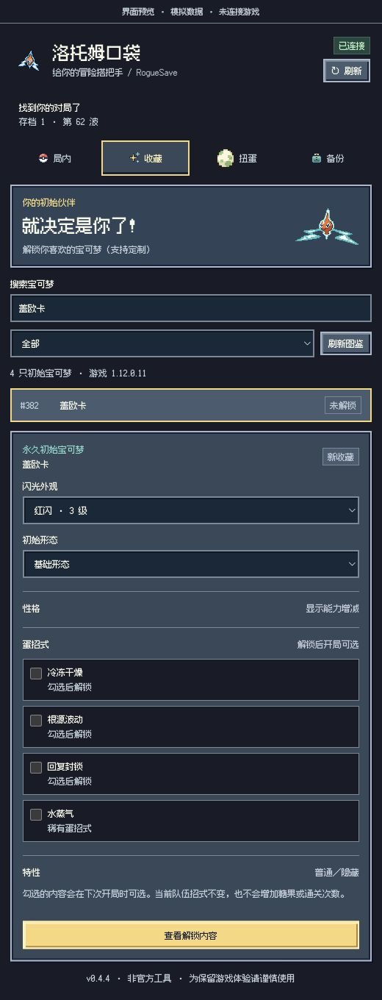
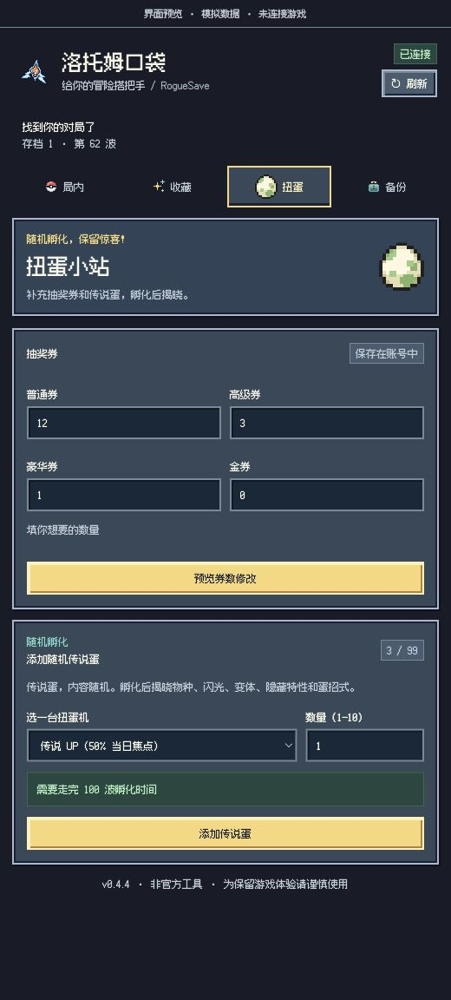

<div align="center">
  
  <h1>洛托姆口袋 · Rotom Pocket</h1>
  <p>给你的 PokéRogue 冒险搭把手。</p>
  <p><a href="#先认识一下宝可梦肉鸽">认识游戏</a> · <a href="#口袋里有什么">看看功能</a> · <a href="#安装">安装</a> · <a href="#第一次使用">开始使用</a> · <a href="#遇到问题">遇到问题</a></p>
</div>

## 先认识一下宝可梦肉鸽

[PokéRogue（宝可梦肉鸽）](https://pokerogue.net/) 是一款在浏览器里就能玩的宝可梦同人游戏，把熟悉的回合制对战和 Roguelite 闯关结合在一起。挑选初始伙伴，挑战一波又一波的野生宝可梦和训练家，在战后选择奖励、叠加道具，带着队伍探索不同地形。

一局失败也不算白玩：捕获和孵化会逐渐丰富你的初始宝可梦收藏，让下一次冒险有更多搭配可选。经典模式适合挑战通关，无尽模式则可以继续尝试队伍的极限。玩法详解见 [官方 Wiki 新手指南](https://wiki.pokerogue.net/guides:new_player_guide)。

游戏由 [Pagefault Games](https://github.com/pagefaultgames) 与社区贡献者共同开发维护，感谢他们持续投入代码、美术、音乐和翻译。想体验游戏或支持原项目，可以从这里开始：

[直接游玩](https://pokerogue.net/) · [游戏源码](https://github.com/pagefaultgames/pokerogue) · [新手指南](https://wiki.pokerogue.net/guides:new_player_guide) · [贡献者名单](https://github.com/pagefaultgames/pokerogue/blob/main/CREDITS.md)

<table>
  <tr><th>挑选初始伙伴</th><th>踏上闯关旅程</th></tr>
  <tr>
    <td></td>
    <td></td>
  </tr>
</table>

<p align="center"><sub>官方代码的离线演示画面（v1.12.0.11），不含官网账号。游戏与美术属于原项目及相应权利方。</sub></p>

> 希望你先享受游戏本身：试试不同队伍，期待下一次遭遇，也给自己留一点挑战。洛托姆口袋只是一个可选的小帮手，按需、少量使用就好，别让修改替代了探索和成长的乐趣。

## 口袋里有什么

洛托姆口袋是一个非官方 Chrome 侧栏扩展。不用打开开发者工具，就能调整当前对局的资源、解锁喜欢的初始伙伴，或补充扭蛋资源；不绑定某一局或某个波数。

- **局内补给**：调整金钱、恢复队伍、补充精灵球与道具，也能等待下一次当地稀有野生遭遇。
- **永久收藏**：解锁喜欢的初始宝可梦，定制闪光、形态、性格、蛋招式与特性，下次开局可选。
- **扭蛋资源**：设置抽奖券总数，或添加内容未知、需要正常孵化的随机传说蛋。
- **备份记录**：下载原生 `.prsv`，查看本机修改记录，在条件满足时撤销局内修改。

亲密度、宝可病毒、暂停进化、满 IV 等进阶操作及完整范围，见 [使用说明](docs/USAGE.md)。

### 就决定是你了！

在“收藏”搜索名字或编号，选中伙伴，再挑选想解锁的内容。已有收藏会保留；可选项以当前游戏为准，不会把它直接塞进正在游玩的队伍。

<table>
  <tr>
    <th>收藏：定制你的初始伙伴</th>
    <th>扭蛋：补充资源，保留惊喜</th>
  </tr>
  <tr>
    <td valign="top"></td>
    <td valign="top"></td>
  </tr>
</table>

以上是工具真实界面的**模拟数据预览**，不是官网账号操作记录，也不代表图中宝可梦配置在游戏中一定可用。截图没有执行保存。

随机蛋不会提前揭晓物种，也不能指定蛋内宝可梦；每枚传说蛋仍需完成 100 波孵化时间。**当前测试版添加传说蛋存在保存结果可能显示“待确认”的已知问题，暂不建议在官网账号使用该项。** 详见 [问题与恢复说明](docs/USAGE.md#保存失败或结果待确认)。

## 安装

当前为 `0.4.4` 测试版，适配 PokéRogue `1.12.0.10–1.12.0.11`，需要 Chrome `116` 或更新版本。游戏更新后可能需要重新适配；未知版本会保持只读。

目前尚未发布 [Release 安装包](https://github.com/seu-yolo/rotom-pocket/releases)。现在可从源码打包；需要 [Node.js 20+](https://nodejs.org/) 和 Git，不需要 `npm install`：

```bash
git clone https://github.com/seu-yolo/rotom-pocket.git
cd rotom-pocket
npm run pack
```

1. 在 Chrome 地址栏打开 `chrome://extensions/`，开启右上角“开发者模式”。
2. 点击“加载已解压的扩展程序”，选择刚生成的 `dist/RogueSave/` 文件夹（里面应直接有 `manifest.json`）。
3. 打开 [PokéRogue 官网](https://pokerogue.net/)，若已经打开则刷新一次游戏页面。
4. 点击浏览器工具栏的“洛托姆口袋”图标，打开侧栏；找不到图标时，到扩展菜单中将它固定。

`RogueSave` 是项目早期名称，安装目录暂时沿用它。仓库准备公开中，目前为私有仓库，克隆需要访问权限。发布后，安装包也会放在 Releases；GitHub 的源码 ZIP 不是可直接加载的扩展包。

升级时更新原来加载的文件夹，再到扩展管理页点“重新加载”。不要卸载扩展或清空数据，否则本机备份和待确认记录可能丢失。

## 第一次使用

1. 只保留一个游戏标签页，进入要修改的对局，停在等待选择招式的界面。
2. 先去“备份”下载修改前的原生对局／账号 `.prsv`，留在自己电脑上。
3. 回到“局内”，例如把金钱填成想要的**最终总金额**，或点“一键全恢复”。
4. 点击“预览”，确认修改内容，再点“保存修改”；保存过程中不要推进游戏。

收藏和券数也先预览再确认。解锁的初始伙伴在下次开局时使用；金钱与券数填的是目标总数，不是额外增加的数量。道具界面会显示当前层数、游戏中的实际上限和剩余额度；持有道具按所选宝可梦分别计算。

切换存档后，点顶部“↻ 刷新”重新连接。这个按钮只刷新洛托姆口袋，不会刷新游戏页，也不会加载新版扩展代码。

更多操作与范围见 [使用说明](docs/USAGE.md)。想在独立离线环境测试，请看 [离线版说明](docs/OFFLINE_TESTING.md)；本仓库不包含游戏本体。

## 遇到问题

**连不上，或预览后状态变了？** 先回到选择招式界面，再点口袋顶部“↻ 刷新”，重新预览。若提示实时会话与缓存不一致，按提示重新载入游戏后再核对。

**看到“结果待确认”？** 先停下，不要反复保存。按提示刷新核对；必要时关闭原游戏标签页，新开同一账号和存档。不要通过删除记录、卸载扩展或绕过检查来解除限制。[详细处理方法](docs/USAGE.md#保存失败或结果待确认)

**备份能帮我恢复官网存档吗？** 官网正式版目前没有账号／对局的菜单导入入口，下载备份不等于能在官网一键回档。局内撤销也有状态条件；收藏、券和蛋暂不支持一键撤销。请在修改永久资源前读一下 [备份与撤销的区别](docs/USAGE.md#备份与撤销)。

**游戏更新后不能修改？** 修改器不是通用存档格式转换器，也不保证未来版本兼容。请等待适配，不要强行修改版本检查。

## 反馈与参与

遇到问题或有想法，欢迎提交 [Issue](https://github.com/seu-yolo/rotom-pocket/issues)。请写清 Chrome／扩展／游戏版本、操作步骤、预期结果和错误提示；截图记得遮住账号信息。不要公开上传真实存档、账号导出、凭据或含个人数据的诊断记录。

想参与开发，可以从 [开发说明](docs/DEVELOPMENT.md) 和 [架构说明](docs/ARCHITECTURE.md) 开始。更新记录在 [CHANGELOG](CHANGELOG.md)，其他资料见 [文档导航](docs/README.md)。

## 非官方声明与致谢

本项目与 Pagefault Games、PokéRogue 团队、Nintendo、Game Freak 或 The Pokémon Company 没有隶属或合作关系。请只操作你有权控制的数据；修改存档有风险，本项目不保证账号安全或任意情况下都能恢复。

扩展只在目标游戏页工作，本机保存修改记录，不读取 Cookie、密码或浏览历史，也不会把存档上传到第三方服务器。账号保存仍通过游戏自身接口完成，不等于工具能独立核实服务器最终状态。

感谢 PokéRogue 与社区的作品，以及 [Fusion Pixel Font](https://github.com/TakWolf/fusion-pixel-font) 的中文像素字体。自有代码许可证尚待确定，第三方图片、字体和游戏截图不属于本项目自有代码许可；来源与权利说明见 [素材说明](docs/ASSETS.md) 和 [THIRD_PARTY_NOTICES](THIRD_PARTY_NOTICES.md)。
