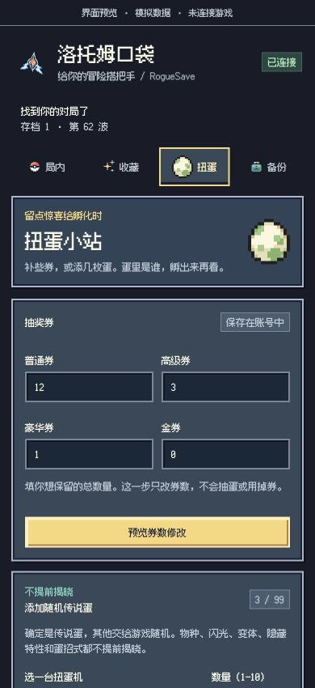

# RogueSave 全项目审查 · 2026-10-04

## 结论

界面已具备清晰的四页结构，权限和局内事务保护也比较完整，但目前不适合标成“稳定版”发布。优先修复传说蛋返回协议和特性表识别，再完成离线扩展实机保存／重载验证。无需再加 hash、冻结 contract、baseline 或门禁；现有保护保留，通过普通代码修复和跨模块测试解决问题即可。

本次只实施用户指出的蛋图替换，没有修改账号、对局或其他游戏功能逻辑。源码版本仍为 0.4.1，这次属于未正式发布的界面审查修订。

### 同日后续：收藏故障排查与修复

下文保留首次审查时的结论；用户随后授权测试并要求修复收藏功能。官网 Chrome 中以关都火焰鸟（红闪、内敛、隐藏特性）复现：预览成功，确认保存提示“账号数据已变化，请重新预览”，收藏仍未解锁，没有推进当前对局。

官方 `BattleScene.initSession()` 每秒更新 `gameData.gameStats.playTime`，该字段进入账号快照。只将计时从 100 改为 101，就能让旧版账号比较返回 `STALE`。修复后台及页面预览／保存核验的比较：仅排除自动计时和时间戳，其他字段保持严格比较；备份保留计时、结果记录保存后的实际计时，运行时计时不回退。新增真实收藏／统计／券冲突测试，保留不确定结果处理。

官网公开入口 `index-CTFFh6u_.js` 将数据表放在动态启动的 BattleScene 依赖中，原模块读取只遍历入口的静态依赖，漏掉蛋招式和特性表。现仅在 BattleScene 构造器已实例化时，识别入口内对应的具名场景导入，再遍历该已运行场景的静态依赖；没有遍历其他动态导入、预加载链接或猜测 URL。特性识别同时排除含 `power` 的招式表。旧数据缓存重新读取。

后续官网实测确认蛋招式与特性名称正常，但页面保存前比对仍拒绝提交。0.4.2 脱敏诊断将差异定位到 `starterData` 的额外字段，而不是计时。增加账号 JSON 文本传递，保持字段结构和完整校验；此时尚待再次重新加载扩展验证，不能断言这是 Chrome 对象传递导致。真实诊断文件只保留在本机临时目录，不进入仓库。

144 项自动化测试和 19 个 JS/MJS 文件语法检查通过，包含空值收藏字段传递、真实冲突拒绝和结果隐私检查。官网／离线安装包已重建为 0.4.2 测试版。传说蛋返回协议问题未在此次收藏修复中处理。

16:09 官网再次实测成功：关都火焰鸟红闪、内敛、火焰之躯保存记录为 `verified`，刷新图鉴后显示已解锁。通过游戏原生账号导出（官网分支从服务端读取）独立确认相同解锁位，未刷新游戏或推进第 1672 波。前后账号快照仅有火焰鸟的外观／性格／特性及最低捕获和见过次数、自动增长的 playTime 变化。其他收藏、券、蛋等未变。证据文件只保存在本机临时目录。修复结果已实测，但未单独隔离 Chrome 各对象传递边界以证明具体丢字段的位置，也未测试新开局选择、全部配置或其他功能。

## 范围与证据

覆盖 `manifest.json`、`src/shared/`、后台、页面适配器、侧栏 HTML/CSS/交互、测试与夹具、打包、离线配置、README、备份说明、素材来源和工作区发布布局。另一个独立项目 `unbound-save-editor-zh` 不属于本次 RogueSave 代码审查；它不进入扩展安装包。

游戏行为对照本机官方源码 tag `v1.12.0.11`，commit `e4e9b5383be7c9e171d32a9daaea2658d475c521`。这是已下载的验证版本，不是对当前官网最新版本的声明。本次没有访问或改写实际账号存档，也没有发布或推送 Git 仓库。

- 修改前：131 项现有自动化测试全部通过。
- 修改后：132 项全部通过，新增原生蛋图资源／帧尺寸测试。
- 16 个工程 JS/MJS 文件通过语法检查；另运行审查复现脚本。
- 官网／离线两种开发安装包重建完成，各 23 个文件，ZIP 结构检查通过；未包含测试或审查夹具。原生蛋 PNG 与上游逐字节一致，两种包分别保留各自目标地址与权限。
- 浏览器检查四页导航、收藏列表、恢复预览、备份警告、图片加载；320／390 像素宽度无横向溢出，浏览器无警告或错误日志。
- 两个功能问题由隔离 Node 模拟实际调用页面适配器／后台复现，不只是静态猜测。
- 尚未验证真实扩展注入、真实游戏保存后重载、原生备份导入导出回环。模拟 UI 的“成功”不能证明这些项目通过。

## 已确认问题（按优先级）

### P1：添加传说蛋成功后，被后台误判为结果不确定

位置：`src/game/page-adapter.js:3305`；`src/background/service-worker.js:1220`。

`addLegendaryEggs()` 成功返回 `ok/code/status/afterSystem`，但没有 `adapterVersion`。后台账号提交要求 `result.adapterVersion === EDITOR_VERSION` 才接受成功。正常执行也会发生：游戏已保存蛋，页面返回 verified，后台却返回 uncertain，侧栏进入写入锁定。

复现命令（仅内存模拟，不连接游戏或网络）：

```sh
node scripts/review-repro.mjs
```

本次输出：

```text
systemSaveCalls: 1
eggCount: 1
pageStatus: 'verified'
pageAdapterVersion: 'missing'
backgroundStatus: 'uncertain'
backgroundOk: false
```

为什么现有测试没发现：页面测试只检查成功状态和蛋属性；后台测试手工构造了带版本号的理想返回值，没有串接真实适配器结果。

建议：补齐成功返回的版本字段；增加真实适配器返回经过后台的集成测试。不要移除后台版本检查或安全锁。修复前不建议通过连续点击添加来判断是否成功，避免误解实际已保存的数量。

### P2：招式数组也会通过特性数组识别，显示错误的特性名称

位置：`src/game/page-adapter.js:280–281`；官方 `src/data/moves/move.ts:158`、`src/data/abilities/ability.ts:41`。

特性数组识别条件为：数组长度 >100，其中有包含数字 `id`、字符串 `name` 和数组 `attrs` 的元素。官方 Move 对象恰好也具备这些字段。因此招式表会同时赋给 `data.moves` 和 `data.abilities`；结果依赖模块导出枚举和读取完成顺序。

同一个复现命令在模拟模块同时导出真实形状的两张表时，观察到：

```text
特性表识别: { expected: '特性1', actual: '招式1' }
```

影响：收藏页特性名称和提交预览会错，用户可能按错误名称选择。解锁时写的是特性槽位位标记，不是将招式 ID 写到特性字段；本次未观察到由此引发存档结构损坏。

为什么测试没发现：收藏测试直接预置已分类的导出缓存，绕过了模块识别。

建议：让招式和特性识别互斥，并核对所选物种的实际特性 ID；添加两张表同时存在、导出顺序变化的普通测试。不需要新增冻结映射表或 hash。

### P2：从独立仓库根目录打包，会将输出放到仓库之外

位置：`scripts/package-extension.mjs:19–20,326`。

打包假设本项目始终位于工作区 `projects/roguesave`，将 `PROJECT_ROOT/../..` 当作工作区根。当前布局正确；以后单独开源、克隆到 `/tmp/demo/roguesave` 时，输出却是 `/tmp/dist/RogueSave`，而非 `/tmp/demo/roguesave/dist/RogueSave`。脚本还会重建该位置的同名扩展输出目录。

影响：独立克隆者找不到安装包；同一上级目录下的多个克隆可能互相覆盖构建产物。这不是新增极端风险，而是独立开源后的普通运行方式。

建议：以项目根的 `dist/` 为默认输出，当前工作区通过显式参数指定集中输出，继续保留现有路径与符号链接检查；为独立克隆方式加一个打包测试。本次未改变打包布局。

### P3：宽窗口底部按钮栏没有跟随主面板宽度

位置：`sidepanel/styles.css:249`。

主面板最大 520px，底栏固定 `left:0;right:0`，铺满视口。实际默认 1280px 预览中，主面板宽 520px、底栏宽 1280px。常规窄侧栏不受影响，但独立预览或较宽侧栏视觉割裂。

建议：底栏居中并限制为与主面板相同的最大宽度。不是保存错误，也不需要为此改变页面架构。

## 发布前仍缺的验证与整理

### 实机验证不能由 132 项模拟测试替代

已有离线游戏能启动，已看到原生导入菜单；但扩展保存／重载和原生导入回环仍未完成，详见 `OFFLINE_TESTING.md`。本次发现的两处问题都说明“各模块模拟测试成功”不等于“模块串起来正确”。

建议用全新离线存档依次测试：金钱、恢复、道具、收藏（实际重新开局确认）、券、传说蛋、一次性遭遇、导出／修改／导入恢复。先完成常见路径，不追求穷举几乎不可能的情况。浏览器内部扩展安装页需要用户手动加载扩展，不能绕过浏览器控制限制。

### 开源材料还没有闭环

- RogueSave 项目根缺少自己的代码 LICENSE，不能把公开仓库直接等同于已经授予开源许可。
- 上游素材声明、原始 Pokémon 角色／商标权利和自己代码的许可是不同层次；不能将所有文件统一标成 MIT。素材来源已记录，但这不是独立权利授权结论。
- 独立发布不要带 `game/`、存档、私人备份、依赖或另一套 Unbound 工程。当前工作区根 `.gitignore` 和安装包收录范围已排除这些文件，但拆出独立仓库时需要保留相应忽略规则。
- 生成图片草稿留在 `docs/assets/`，不进入安装包；公开源码时可移除不再使用的草稿，减少体积和解释成本。本次没有删除这些历史素材。
- README/CHANGELOG 的 0.4.1 介绍主要记录早先界面改动，后来的离线实验与备份语义修正需要在下一个正式版本说明中统一。此次加“未发布”记录，不伪装成已经完成稳定版发行。

这些是发布准备建议，不是法律合规保证。本次没有替用户选择代码许可、建立公开仓库或推送任何文件。

## 本次蛋图修复

删除不易辨认的自绘 `egg.svg`，改用上游 `images/egg/egg_icons.png` 普通蛋帧：白壳、绿色斑点，来自素材提交 `909b43612324622608023b3beb2f24f4ef159c1d`。

PNG 原样复制，CSS 显示 atlas 的 (0,0)、13×14 帧。导航 2 倍、标题装饰 4 倍放大；保持像素边缘。没有重新绘图，没有增加远程请求或扩展权限，也没有改动抽蛋概率。普通蛋图只表示“扭蛋功能”，添加功能仍是传说蛋。

已更新 HTML、CSS、模拟预览资源列表、素材说明、随包 CREDITS、第三方声明及静态测试。预览如下，使用模拟数据：



## 保留的优点与边界

| 模块 | 审查结果 |
| --- | --- |
| 扩展权限 | 官网版只申请 scripting、sidePanel、storage 及 pokerogue.net 目标权限；没有跨站内容脚本或外部消息入口 |
| 离线隔离 | 独立打包，后台验证完整 `127.0.0.1:8000` origin；端口／官网拒绝测试通过，不能据此宣称实机注入已验证 |
| 局内事务 | 先预览与留备份、写入锁、陈旧状态拒绝、限定编辑范围、失败恢复、结果不确定隔离、精确状态撤销已有覆盖；本次未弱化这些保护 |
| 永久解锁 | 按当前版本合法初始物种／形态／闪光选项增加位标记；保留已有收藏、不增加糖果或通关次数；特性名称识别问题需先修复 |
| 道具 | 限定支持工厂，使用官方实际层数上限，不开放任意运行代码或任意道具结构写入 |
| 扭蛋 | 固定传说层级，通过官方 pullEggs/Egg 流程生成其余属性，100 波孵化；返回协议有已确认错误，不应视作已通过端到端验证 |
| 稀有遭遇 | 按地形官方池、训练家跳过、双打第一只、一次触发后恢复；不是指定物种，也不能保证后续官方特殊遭遇替换不发生 |
| 备份 | 原生账号／对局文件分开；JSON 是排查记录、不能导入游戏；官网正式版无普通菜单恢复保证，现有警告准确 |
| 隐私 | 备份留扩展本机存储，界面未增加第三方图片／字体请求；导出 JSON 含账号及存档数据，分享前应脱敏 |
| UI | 四页、折叠高级项、键盘分页、可见标签、像素字体与本机图片基本一致；窄屏无横向溢出，宽窗口底栏仍需微调 |
| 安装包 | 只收录 manifest/src/sidepanel；不含游戏本体、测试夹具或个人存档；独立仓库输出路径仍需修正 |

## 建议下一步

先修传说蛋返回协议 → 修特性表分类并加集成测试 → 在离线存档跑一次完整保存／重载／恢复 → 整理独立仓库打包和 LICENSE → 以 Alpha 明确公布验证范围。暂不建议继续堆新功能或增加新的校验框架。
